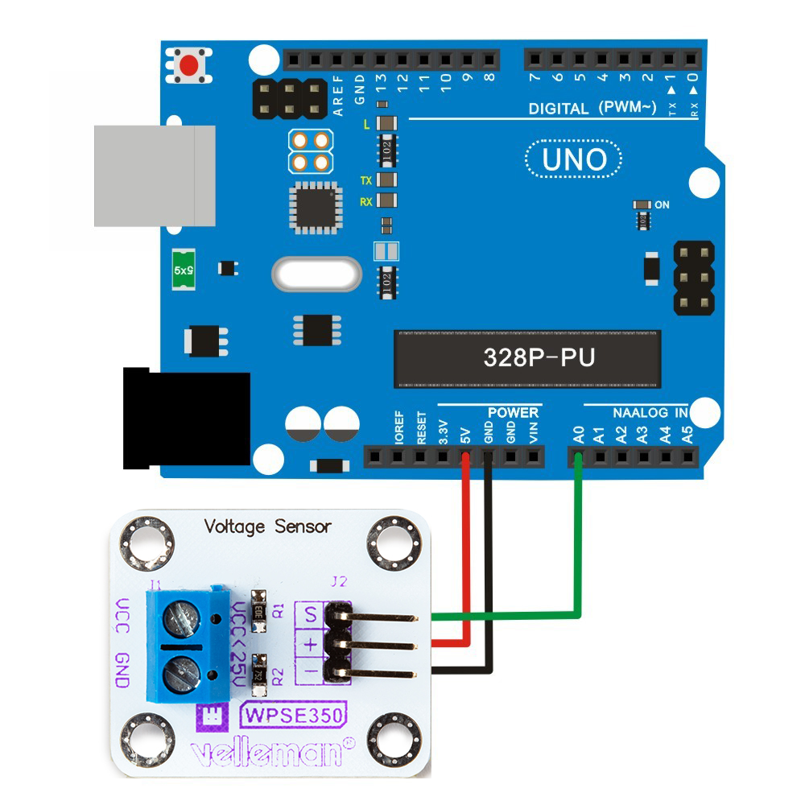

# WPSE350 0-25 V DC voltage sensor module
This example shows how you can use the Whadda WPSE350 0-25 V DC voltage sensor module with an Arduino® compatible board to read voltages and print them in the serial monitor.

## Library dependencies
* None

## Wiring diagram

## Additional information
  For more information about the Whadda WPSE350 0-25 V DC voltage sensor module, check the manual available at [whadda.com](https://whadda.com)

## Acknowledgments